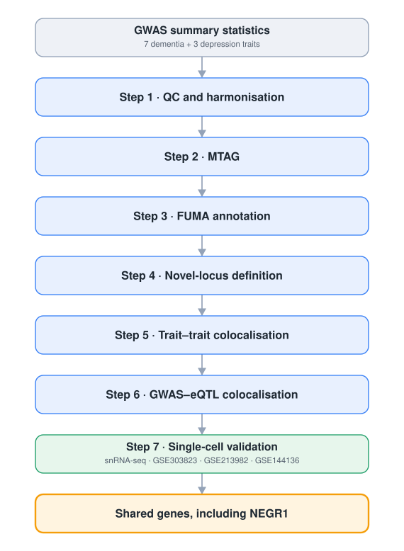

<div align="center">

# 🧬 Dementia–Depression Multi-Trait Analysis Pipeline

**An end-to-end genomic workflow for dissecting the shared genetic architecture of dementia and depression**

<p>
  <a href="https://opensource.org/licenses/MIT"></a>
  <a href="https://www.r-project.org/"></a>
  <a href="https://www.python.org/"></a>
  
  
</p>

<p>
  <b>MTAG</b> · <b>FUMA</b> · <b>HyPrColoc</b> · <b>SMR</b> · <b>single-nucleus RNA-seq</b>
</p>

[Overview](#-overview) ·
[Pipeline](#-pipeline-at-a-glance) ·
[Data](#-gwas-data-sources) ·
[Install](#-installation) ·
[Run](#-running-the-pipeline) ·
[Cite](#-citation)

</div>

---

## 📋 Table of Contents

- [Overview](#-overview)
- [Data and code availability](#-data-and-code-availability)
- [Scientific rationale](#-scientific-rationale)
- [Pipeline at a glance](#-pipeline-at-a-glance)
- [Repository structure](#-repository-structure)
- [GWAS data sources](#-gwas-data-sources)
- [Single-cell data sources](#-single-cell-data-sources)
- [Installation](#-installation)
- [Running the pipeline](#-running-the-pipeline)
- [Outputs](#-outputs)
- [Reproducibility notes](#-reproducibility-notes)
- [Troubleshooting](#-troubleshooting)
- [Citation](#-citation)
- [License](#-license)
- [Authors and acknowledgements](#-authors-and-acknowledgements)

---

## 🎯 Overview

This repository contains the full computational pipeline behind a multi-trait genetic study of dementia and depression comorbidity. It moves from raw public European-ancestry GWAS summary statistics to harmonised inputs, joint multi-trait association (MTAG), functional annotation (FUMA), novel-locus definition, statistical colocalisation (HyPrColoc) against brain expression panels, and single-nucleus transcriptomic validation centred on the candidate gene **NEGR1**.

The code is organised as **seven sequential stages**, each in its own numbered folder. Stages are modular, so a stage can be run on its own provided its inputs are present. R drives quality control, colocalisation, and single-cell work; Python drives FUMA post-processing and novel-locus definition; MTAG runs from the command line under a Python 2.7 environment on Linux.

```text
56.8% R   ·   43.2% Python   ·   ~4,000 lines across 23 scripts (13 R, 10 Python)
```

---

## 📦 Data and code availability

All data and code needed to reproduce the analyses are openly available. No controlled-access application is required to obtain the summary statistics or single-cell data used here.

- **Code.** Every analysis script is in this repository, organised into the seven pipeline stages described below. The public tools required are listed under [Installation](#-installation).
- **GWAS summary statistics.** All ten input GWAS are public and European-ancestry. Dementia and depression statistics come from the GWAS Catalog and from FinnGen release R12. Accessions, genome builds, ancestry, and source studies with DOIs are listed under [GWAS data sources](#-gwas-data-sources).
- **Single-nucleus RNA-seq.** The three single-cell datasets are public in the Gene Expression Omnibus under accessions GSE303823, GSE213982, and GSE144136, detailed under [Single-cell data sources](#-single-cell-data-sources).
- **Brain eQTL panels.** Colocalisation uses the public GTEx v7 and MetaBrain cortex eQTL panels.
- **Reference resources.** dbSNP 144, the 1000 Genomes reference, and UCSC liftover chains are listed under [Reference resources](#reference-resources).

---

## 🔬 Scientific rationale

Dementia and depression co-occur far more often than chance, and the direction of that relationship is hard to separate from confounding and reverse causation in observational data. Genetic data offer a complementary angle. If the two phenotypes share causal variants, that shared signal points toward common biological mechanisms rather than purely epidemiological association.

This pipeline addresses three questions in sequence.

1. **Where do dementia and depression share association signal?** MTAG borrows power across genetically correlated traits to sharpen joint effect estimates and surface loci that single-trait GWAS underpowers.
2. **Which of those loci are shared rather than merely neighbouring?** HyPrColoc tests whether two traits, or a trait and a brain eQTL, are driven by the same causal variant within a region, distinguishing true colocalisation from linkage-driven coincidence.
3. **Is the candidate mechanism visible at single-cell resolution?** Single-nucleus RNA-seq of human brain tissue tests whether prioritised genes, in particular NEGR1, show cell-type-specific differential expression, co-expression structure, altered cell communication, and sensitivity to in-silico knockout.

---

## 🗺 Pipeline at a glance

The workflow runs as a single linear pipeline. European-ancestry GWAS summary statistics for ten traits pass through quality control, joint multi-trait association, functional annotation, novel-locus definition, and two colocalisation stages. Genes prioritised by these stages are then examined in single-nucleus brain transcriptomes, and the pipeline converges on shared, mechanistically supported genes including NEGR1.

<div align="center">
  
</div>

| Stage | Folder | Language | Core tools |
| ----- | ------ | -------- | ---------- |
| 1 | `Step 1. Quality control_GWAS` | R | MungeSumstats, rtracklayer, data.table |
| 2 | `Step 2. MTAG_Linux command` | Shell / Python 2.7 | MTAG |
| 3 | `Step 3. Functional mapping and annotation (FUMA)` | Python | pandas, FUMA outputs |
| 4 | `Step 4. Novel loci definition and replication` | Python / Shell | pandas, SMR |
| 5 | `Step 5. Trait-trait colocalisation analysis` | R / Python | hyprcoloc |
| 6 | `Step 6. trait-eQTL colocalisation analysis` | R / Python | hyprcoloc, GTEx v7, MetaBrain |
| 7 | `Step 7. Single-cell RNA analysis` | R | Seurat, MAST, hdWGCNA, muscat, CellChat, scTenifoldKnk |

---

## 📁 Repository structure

```text
Dementia_Depression_Multi-traits-analysis/
│
├── Step 1. Quality control_GWAS/
│   ├── Step1-QC_GWAS_DEMtraits.R          # Alzheimer's, cognition, FTD, Lewy body dementia
│   ├── Step1-QC_GWAS_DDtraits.R           # depressive disorders, MADD, MDD
│   └── Step1-QC_GWAS_Finngen.R            # FinnGen R12 dementia endpoints
│
├── Step 2. MTAG_Linux command/
│   └── Step2-MTAG_linux.txt               # py2.7 environment setup and MTAG invocation
│
├── Step 3. Functional mapping and annotation (FUMA)/
│   ├── Step3-FUMA_1_Table_creating.py     # parse raw FUMA outputs into per-locus tables
│   ├── Step3-FUMA_2_Merging_by_trait.py   # merge annotations across trait pairs
│   ├── Step3-FUMA_3_Robust_filter.py      # concordance and robustness checks
│   ├── Step3-FUMA_4_Delete_failed.py      # drop non-robust entries
│   ├── Step3-FUMA_5_Unique_IndSNPs.py     # deduplicate independent lead SNPs
│   ├── Step3-FUMA_6.1_ExamSNPs_dementia.py
│   └── Step3-FUMA_6.2_ExamSNPs_depression.py
│
├── Step 4. Novel loci definition and replication/
│   ├── Step4-NovelLoci_1_definition.py    # flag loci absent from known catalogues
│   └── Step4-NovelLoci_2_replication_SMR.txt
│
├── Step 5. Trait-trait colocalisation analysis/
│   ├── Step5-Hyprcoloc_Trait-Trait.R      # HyPrColoc across trait pairs at sentinels
│   └── Step5_Merging_Trait-Trait_coloc.py # consolidate per-pair results
│
├── Step 6. trait-eQTL colocalisation analysis/
│   ├── Step6-Hyprcoloc_GWAS-eQTL.R        # HyPrColoc versus GTEx v7 brain eQTL
│   ├── Step6-Hyprcoloc_3_GWAS-eQTLBrain.R # HyPrColoc versus MetaBrain eQTL
│   ├── Step6_Merging_1_gene_symbol.R      # map probes to gene symbols
│   └── Step6_Merging_2_GWAS-eQTL_coloc.py # consolidate eQTL colocalisation results
│
├── Step 7. Single-cell RNA analysis/
│   ├── Step7-scRNA_analysis_Rset.R        # environment and library setup
│   ├── Step7-01scRNA_analysis_QC.R        # Seurat ingestion, QC, diagnosis labelling
│   ├── Step7-02scRNA_analysis_MAST&hdWGCNA.R  # cell-type DE and co-expression networks
│   ├── Step7-03scRNA_analysis_muscat.R    # pseudobulk differential state analysis
│   ├── Step7-04scRNA_analysis_CellChat.R  # cell–cell communication, NEGR signalling
│   └── Step7-05scRNA_analysis_scTenifoldKnk.R  # in-silico NEGR1 knockout
│
├── LICENSE                                 # MIT
└── README.md
```

---

## 🧾 GWAS data sources

All summary statistics are publicly available. Download each file and place it under a local `Downloaded_original_data/` directory before running Step 1. Respect the data-use terms of each provider. If your file names differ from those below, update them consistently across every stage that reads them.

> **Note.** Builds are mixed across sources. Step 1 harmonises every study to GRCh37 (hg19), lifting GRCh38 coordinates down with `rtracklayer` where required.

### Dementia-related traits (7)

| Trait | Accession | Build | Ancestry | Study |
| ----- | --------- | ----- | -------- | ----- |
| Alzheimer's disease | [`GCST90012877`](https://www.ebi.ac.uk/gwas/studies/GCST90012877) | GRCh37 | European | Schwartzentruber et al. (2021) *Nat. Genet.* 53, 392–402. [doi:10.1038/s41588-020-00776-w](https://doi.org/10.1038/s41588-020-00776-w) |
| Cognitive performance | [`GCST006572`](https://www.ebi.ac.uk/gwas/studies/GCST006572) | GRCh37 | European | Lee et al. (2018) *Nat. Genet.* 50, 1112–1121. [doi:10.1038/s41588-018-0147-3](https://doi.org/10.1038/s41588-018-0147-3) |
| Frontotemporal dementia | [`GCST90558311`](https://www.ebi.ac.uk/gwas/studies/GCST90558311) | GRCh37 | European | Pottier et al. (2025) *Nat. Commun.* 16, 3914. [doi:10.1038/s41467-025-59216-0](https://doi.org/10.1038/s41467-025-59216-0) |
| Lewy body dementia | [`GCST90001390`](https://www.ebi.ac.uk/gwas/studies/GCST90001390) | GRCh38 | European | Chia et al. (2021) *Nat. Genet.* 53, 294–303. [doi:10.1038/s41588-021-00785-3](https://doi.org/10.1038/s41588-021-00785-3) |
| Overall dementia | [`F5_DEMENTIA`](https://r12.risteys.finngen.fi/endpoints/F5_DEMENTIA) (FinnGen R12) | GRCh38 | European (Finnish) | Kurki et al. (2023) *Nature* 613, 508–518. [doi:10.1038/s41586-022-05473-8](https://doi.org/10.1038/s41586-022-05473-8) |
| Vascular dementia | [`F5_VASCDEM`](https://r12.risteys.finngen.fi/endpoints/F5_VASCDEM) (FinnGen R12) | GRCh38 | European (Finnish) | Kurki et al. (2023) *Nature* 613, 508–518. [doi:10.1038/s41586-022-05473-8](https://doi.org/10.1038/s41586-022-05473-8) |
| Undefined dementia | [`F5_DEMNAS`](https://r12.risteys.finngen.fi/endpoints/F5_DEMNAS) (FinnGen R12) | GRCh38 | European (Finnish) | Kurki et al. (2023) *Nature* 613, 508–518. [doi:10.1038/s41586-022-05473-8](https://doi.org/10.1038/s41586-022-05473-8) |

### Depression-spectrum traits (3)

| Trait | Accession | Build | Ancestry | Study |
| ----- | --------- | ----- | -------- | ----- |
| Depressive disorders | [`GCST90476922`](https://www.ebi.ac.uk/gwas/studies/GCST90476922) | GRCh38 | European | Verma et al. (2024) *Science* 385, eadj1182. [doi:10.1126/science.adj1182](https://doi.org/10.1126/science.adj1182) |
| Major depressive disorder | [`GCST90468123`](https://www.ebi.ac.uk/gwas/studies/GCST90468123) | GRCh37 | European | Loya et al. (2025) *Nat. Genet.* 57, 461–468. [doi:10.1038/s41588-024-02044-7](https://doi.org/10.1038/s41588-024-02044-7) |
| Mixed anxiety and depressive disorder | [`GCST90225526`](https://www.ebi.ac.uk/gwas/studies/GCST90225526) | GRCh37 | European | Brasher et al. (2023) *Genes Brain Behav.* 22, e12851. [doi:10.1111/gbb.12851](https://doi.org/10.1111/gbb.12851) |

> **Ancestry and reference-panel coherence.** All ten input GWAS are European-ancestry. FinnGen contributes the Finnish founder population, a European genetic isolate whose population bottleneck gives it a linkage-disequilibrium profile that differs from outbred European samples. Holding ancestry constant matches both the downstream references and the assumptions of the methods used here. MTAG and HyPrColoc assume ancestry-comparable linkage disequilibrium across inputs, the linkage-disequilibrium reference for FUMA and SMR is 1000 Genomes EUR, and the brain expression panels are predominantly European (GTEx v7) and European by construction (MetaBrain Cortex-EUR). Harmonising every study to GRCh37 (hg19) also aligns coordinates with GTEx v7 and the 1000 Genomes hs37d5 reference, both on hg19.

### Reference resources

| Resource | Used for | Notes |
| -------- | -------- | ----- |
| dbSNP 144 (GRCh37 and GRCh38) | rsID and allele harmonisation | `SNPlocs.Hsapiens.dbSNP144.*` |
| 1000 Genomes hs37d5 | reference alleles | `BSgenome.Hsapiens.1000genomes.hs37d5` |
| UCSC liftover chains | build conversion | for example `hg38ToHg19.over.chain` |
| GTEx v7 brain eQTL | GWAS–eQTL colocalisation | Step 6 |
| MetaBrain brain eQTL | GWAS–eQTL colocalisation | Step 6 |
| 1000 Genomes EUR (PLINK) | LD reference for downstream tools | FUMA, SMR |

---

## 🧫 Single-cell data sources

Step 7 uses publicly available human-brain single-nucleus RNA-seq.

| Dataset | Phenotype | Groups | Role |
| ------- | --------- | ------ | ---- |
| [GSE303823](https://www.ncbi.nlm.nih.gov/geo/query/acc.cgi?acc=GSE303823) | Dementia | Control, ADD, DLB, PDD | annotated reference object, dementia versus control contrasts |
| [GSE213982](https://www.ncbi.nlm.nih.gov/geo/query/acc.cgi?acc=GSE213982) | Major depressive disorder | case, control | count matrix with per-barcode cell-type labels |
| [GSE144136](https://www.ncbi.nlm.nih.gov/geo/query/acc.cgi?acc=GSE144136) | Major depressive disorder | case, control | sample-level metadata via GEOquery |

---

## 💻 Installation

### Prerequisites

- **R** ≥ 4.2
- **Python** ≥ 3.8 for FUMA and novel-locus scripts
- **Python 2.7** for MTAG only, isolated in its own Conda environment
- **Linux** for MTAG. The remaining stages run on Linux or Windows
- **Conda** recommended for environment management

### 1. Clone

```bash
git clone https://github.com/Hexiao-DING/Dementia_Depression_Multi-traits-analysis.git
cd Dementia_Depression_Multi-traits-analysis
```

### 2. R dependencies

<details>
<summary><b>GWAS QC and colocalisation packages</b></summary>

```r
# CRAN
install.packages(c(
  "data.table", "dplyr", "tidyr", "stringr", "readr",
  "httr", "devtools", "RcppEigen", "DBI", "duckdb",
  "openxlsx", "writexl"
))

# Bioconductor
if (!requireNamespace("BiocManager", quietly = TRUE)) install.packages("BiocManager")
BiocManager::install(c(
  "MungeSumstats", "rtracklayer", "biomaRt",
  "SNPlocs.Hsapiens.dbSNP144.GRCh37",
  "SNPlocs.Hsapiens.dbSNP144.GRCh38",
  "BSgenome.Hsapiens.1000genomes.hs37d5"
))

# Colocalisation
install.packages("hyprcoloc", repos = "https://cloud.r-project.org")
```
</details>

<details>
<summary><b>Single-cell packages (Step 7)</b></summary>

```r
# CRAN and core single-cell
install.packages(c(
  "Seurat", "tidyverse", "Matrix", "qs", "igraph", "ggrepel",
  "patchwork", "cowplot", "plyr", "purrr", "viridis", "randomcoloR",
  "clustree", "UpSetR", "WGCNA"
))

# Bioconductor
BiocManager::install(c(
  "SingleCellExperiment", "scater", "MAST", "muscat", "limma",
  "GEOquery", "SingleR", "GSVA", "GSEABase", "BiocParallel", "NMF"
))

# GitHub-hosted tools
devtools::install_github(c(
  "smorabit/hdWGCNA",
  "sqjin/CellChat",
  "cailab-tamu/scTenifoldKnk",
  "immunogenomics/harmony"
))
# Additional helpers used in the scripts: scCustomize, SCpubr, UCell, irGSEA, monocle, CCA
```
</details>

### 3. Python dependencies

```bash
# FUMA and novel-locus scripts (Python 3)
conda create -n gwas_py python=3.10 -y
conda activate gwas_py
pip install pandas numpy
```

### 4. MTAG (Linux, Python 2.7)

Follow `Step 2. MTAG_Linux command/Step2-MTAG_linux.txt`. In summary:

```bash
conda create -n py27 python=2.7 -y
conda activate py27
conda install -y numpy scipy pandas argparse bitarray joblib
conda install -y libgfortran==1

wget https://github.com/JonJala/mtag/archive/refs/heads/master.zip
unzip master.zip && cd mtag-master
```

### 5. External tools

| Tool | Type | Reference |
| ---- | ---- | --------- |
| MTAG | command line | [JonJala/mtag](https://github.com/JonJala/mtag) |
| FUMA | web service | [fuma.ctglab.nl](https://fuma.ctglab.nl/) |
| SMR | command line, optional (v1.3.1) | [yanglab SMR](https://yanglab.westlake.edu.cn/software/smr/) |
| PLINK | command line | 1000 Genomes EUR reference |

---

## ▶️ Running the pipeline

> **Important.** Scripts use absolute paths from the original project layout, rooted at `D:/Projects_data&code/Stage1_bioinformatics_ADandDepression`. Python scripts set their paths inside a `__main__` block or a function call at the bottom of the file rather than reading command-line flags. Before running any stage, open the script and edit the input and output paths to match your machine. Create parent directories first, since most scripts do not create them automatically.

### Step 1 · QC and harmonisation

```r
# In R, edit setwd() and the Downloaded_original_data paths, then run the trait group you need
source("Step 1. Quality control_GWAS/Step1-QC_GWAS_DEMtraits.R")   # Alzheimer's, cognition, FTD, LBD
source("Step 1. Quality control_GWAS/Step1-QC_GWAS_DDtraits.R")    # depressive disorders, MADD, MDD
source("Step 1. Quality control_GWAS/Step1-QC_GWAS_Finngen.R")     # FinnGen R12 dementia endpoints
```

Each script standardises column names, derives beta and standard error from odds ratios where only an OR and confidence interval are reported, computes minor allele frequency and Z, harmonises alleles, and lifts GRCh38 studies down to GRCh37 (hg19). Outputs land in `Format_sumstats_data/` and `Final_processed_data/`.

### Step 2 · MTAG

```bash
conda activate py27
cd mtag-master
python mtag.py \
  --sumstats "MTAGMDDsummary.txt,MTAGADsummary.txt" \
  --out "/path/to/MTAG_results/MDD_AD" \
  --n_min 0.0 \
  --force \
  --stream_stdout
```

Run one invocation per trait pair. `--n_min 0.0` disables the minimum sample-size-ratio filter. Joint summary statistics from this stage feed every later stage.

### Step 3 · FUMA post-processing

Upload harmonised or MTAG statistics to FUMA, download the result archives, then process them in order. Edit the directory constants near the top or bottom of each script before running.

```bash
conda activate gwas_py
python "Step 3. Functional mapping and annotation (FUMA)/Step3-FUMA_1_Table_creating.py"
python "Step 3. Functional mapping and annotation (FUMA)/Step3-FUMA_2_Merging_by_trait.py"
python "Step 3. Functional mapping and annotation (FUMA)/Step3-FUMA_3_Robust_filter.py"
python "Step 3. Functional mapping and annotation (FUMA)/Step3-FUMA_4_Delete_failed.py"
python "Step 3. Functional mapping and annotation (FUMA)/Step3-FUMA_5_Unique_IndSNPs.py"
python "Step 3. Functional mapping and annotation (FUMA)/Step3-FUMA_6.1_ExamSNPs_dementia.py"
python "Step 3. Functional mapping and annotation (FUMA)/Step3-FUMA_6.2_ExamSNPs_depression.py"
```

| Script | Purpose |
| ------ | ------- |
| `1_Table_creating` | parse raw FUMA outputs (`leadSNPs.txt`, `IndSigSNPs.txt`, `snps.txt`, `annov.txt`) into harmonised per-locus tables |
| `2_Merging_by_trait` | merge locus annotations across trait pairs |
| `3_Robust_filter` | concordance and robustness checks against the source statistics |
| `4_Delete_failed` | drop non-robust entries, keep high-confidence loci |
| `5_Unique_IndSNPs` | deduplicate independent lead SNPs by trait combination |
| `6.1` / `6.2` | build dementia-specific and depression-specific inspection tables |

### Step 4 · Novel-locus definition

```bash
python "Step 4. Novel loci definition and replication/Step4-NovelLoci_1_definition.py"
```

Cross-references FUMA loci against the GWAS Catalog (`gwascatalog.txt`) to flag loci not previously reported. `Step4-NovelLoci_2_replication_SMR.txt` documents converting eQTL summary data to BESD format and running SMR against the MTAG signals for replication.

### Step 5 · Trait–trait colocalisation

```r
source("Step 5. Trait-trait colocalisation analysis/Step5-Hyprcoloc_Trait-Trait.R")
```
```bash
python "Step 5. Trait-trait colocalisation analysis/Step5_Merging_Trait-Trait_coloc.py"
```

Builds effect and standard-error matrices from MTAG results at sentinel SNPs, runs HyPrColoc per trait pair, then consolidates posterior probabilities and credible sets into a single table.

### Step 6 · GWAS–eQTL colocalisation

```r
source("Step 6. trait-eQTL colocalisation analysis/Step6-Hyprcoloc_GWAS-eQTL.R")        # GTEx v7
source("Step 6. trait-eQTL colocalisation analysis/Step6-Hyprcoloc_3_GWAS-eQTLBrain.R")  # MetaBrain
source("Step 6. trait-eQTL colocalisation analysis/Step6_Merging_1_gene_symbol.R")       # probe to symbol
```
```bash
python "Step 6. trait-eQTL colocalisation analysis/Step6_Merging_2_GWAS-eQTL_coloc.py"
```

Tests MTAG loci for colocalisation with brain eQTL panels across harmonised allele windows, maps probes to gene symbols, and consolidates the results.

### Step 7 · Single-cell validation

Load the environment script first, then run the analyses in order. Set `setwd()` and the dataset paths at the top of each file.

```r
source("Step 7. Single-cell RNA analysis/Step7-scRNA_analysis_Rset.R")          # libraries
source("Step 7. Single-cell RNA analysis/Step7-01scRNA_analysis_QC.R")          # QC, diagnosis labels
source("Step 7. Single-cell RNA analysis/Step7-02scRNA_analysis_MAST&hdWGCNA.R") # DE + co-expression
source("Step 7. Single-cell RNA analysis/Step7-03scRNA_analysis_muscat.R")       # pseudobulk DS
source("Step 7. Single-cell RNA analysis/Step7-04scRNA_analysis_CellChat.R")     # cell communication
source("Step 7. Single-cell RNA analysis/Step7-05scRNA_analysis_scTenifoldKnk.R") # NEGR1 knockout
```

| Script | Method | Output |
| ------ | ------ | ------ |
| `01_QC` | Seurat, scCustomize | quality-controlled objects, harmonised diagnosis labels |
| `02_MAST&hdWGCNA` | MAST, hdWGCNA | cell-type differential expression, co-expression modules |
| `03_muscat` | muscat | pseudobulk differential-state genes by cell type |
| `04_CellChat` | CellChat | cell–cell communication networks, NEGR signalling |
| `05_scTenifoldKnk` | scTenifoldKnk | virtual NEGR1 knockout, differential gene regulation |

---

## 📤 Outputs

| Output | Typical location | Description |
| ------ | ---------------- | ----------- |
| Harmonised GWAS | `Final_processed_data/` | QC'd, build-harmonised summary statistics |
| MTAG results | MTAG output prefix | joint multi-trait statistics per trait pair |
| FUMA tables | FUMA results directory | per-locus annotation, robust and deduplicated lead SNPs |
| Novel loci | novel-locus output | candidate loci absent from known catalogues |
| Colocalisation | colocalisation output | trait–trait and GWAS–eQTL posterior probabilities and credible sets |
| Single-cell | per-script output | DE tables, co-expression modules, communication networks, knockout results |

---

## 🔁 Reproducibility notes

- **Paths.** Every script encodes absolute Windows-style paths from the original analysis. Edit these before running, or mirror the directory layout locally.
- **Builds.** Inputs arrive in a mix of GRCh37 and GRCh38. Confirm the build of each source, keep liftover chain files available, and verify a consistent build before MTAG and colocalisation.
- **Ancestry.** All input GWAS are European-ancestry, matching the 1000 Genomes EUR linkage-disequilibrium reference and the European brain expression panels used downstream. MTAG corrects for cross-trait sample overlap through the LDSC intercept. Keeping inputs within one ancestry avoids linkage-disequilibrium mismatch in MTAG and in the colocalisation steps.
- **Allele orientation.** Effect-allele orientation must be consistent across traits before MTAG and across trait and eQTL before HyPrColoc. Misaligned alleles are a common cause of spurious or absent signal.
- **MTAG environment.** MTAG depends on Python 2.7 and an older Fortran runtime. Keep it isolated from the Python 3 and R environments used elsewhere.
- **Disk.** Intermediate GWAS and eQTL files are large. Allow ample free space before starting.

---

## 🔧 Troubleshooting

| Symptom | Likely cause and fix |
| ------- | -------------------- |
| Missing columns during harmonisation | check delimiter, header case, and required fields (SNP, CHR, BP, effect and other allele, BETA or OR, SE, P) |
| Build mismatch between traits | confirm the source build and the liftover chain path used by `rtracklayer` |
| MTAG alignment errors | verify allele orientation and sample-size metadata, and that SNP identifiers match across traits |
| FUMA parsing errors | unzip FUMA archives and keep the original directory structure before Step 3 |
| HyPrColoc returns nothing | check MAF and effect alignment, region window size, and missingness filters |
| Single-cell object will not load | confirm the GEO files, the matrix and barcode and feature triplet, and the working directory |

---

## 📚 Citation

If this pipeline supports your work, please cite the repository and the methods it builds on.

**Repository**
> Ding H, Li N, Yoo JS. Dementia–Depression Multi-Trait Analysis Pipeline. GitHub repository. https://github.com/Hexiao-DING/Dementia_Depression_Multi-traits-analysis

<details>
<summary><b>Methods references</b></summary>

- **MTAG.** Turley P, Walters RK, Maghzian O, et al. Multi-trait analysis of genome-wide association summary statistics using MTAG. *Nat Genet*. 2018;50:229–237. [doi:10.1038/s41588-017-0009-4](https://doi.org/10.1038/s41588-017-0009-4)
- **FUMA.** Watanabe K, Taskesen E, van Bochoven A, et al. Functional mapping and annotation of genetic associations with FUMA. *Nat Commun*. 2017;8:1826. [doi:10.1038/s41467-017-01261-5](https://doi.org/10.1038/s41467-017-01261-5)
- **HyPrColoc.** Foley CN, Staley JR, Breen PG, et al. A fast and efficient colocalization algorithm for identifying shared genetic risk factors across multiple traits. *Nat Commun*. 2021;12:764. [doi:10.1038/s41467-020-20885-8](https://doi.org/10.1038/s41467-020-20885-8)
- **SMR.** Zhu Z, Zhang F, Hu H, et al. Integration of summary data from GWAS and eQTL studies predicts complex trait gene targets. *Nat Genet*. 2016;48:481–487. [doi:10.1038/ng.3538](https://doi.org/10.1038/ng.3538)
- **Seurat.** Hao Y, Hao S, Andersen-Nissen E, et al. Integrated analysis of multimodal single-cell data. *Cell*. 2021;184:3573–3587. [doi:10.1016/j.cell.2021.04.048](https://doi.org/10.1016/j.cell.2021.04.048)
- **MAST.** Finak G, McDavid A, Yajima M, et al. MAST, a flexible statistical framework for single-cell RNA sequencing data. *Genome Biol*. 2015;16:278. [doi:10.1186/s13059-015-0844-5](https://doi.org/10.1186/s13059-015-0844-5)
- **hdWGCNA.** Morabito S, Reese F, Rahimzadeh N, et al. hdWGCNA identifies co-expression networks in high-dimensional transcriptomics data. *Cell Rep Methods*. 2023;3:100498. [doi:10.1016/j.crmeth.2023.100498](https://doi.org/10.1016/j.crmeth.2023.100498)
- **muscat.** Crowell HL, Soneson C, Germain PL, et al. muscat detects subpopulation-specific state transitions from multi-sample multi-condition single-cell transcriptomics data. *Nat Commun*. 2020;11:6077. [doi:10.1038/s41467-020-19894-4](https://doi.org/10.1038/s41467-020-19894-4)
- **CellChat.** Jin S, Guerrero-Juarez CF, Zhang L, et al. Inference and analysis of cell-cell communication using CellChat. *Nat Commun*. 2021;12:1088. [doi:10.1038/s41467-021-21246-9](https://doi.org/10.1038/s41467-021-21246-9)
- **scTenifoldKnk.** Osorio D, Zhong Y, Li G, et al. scTenifoldKnk, an efficient virtual knockout tool for gene function predictions via single-cell gene regulatory network perturbation. *Patterns*. 2022;3:100434. [doi:10.1016/j.patter.2022.100434](https://doi.org/10.1016/j.patter.2022.100434)

</details>

---

## 📄 License

Released under the [MIT License](LICENSE). Copyright (c) 2025 Hexiao-DING.

The pipeline depends on third-party tools and public datasets carrying their own licenses and data-use terms. Review and comply with each before use and redistribution.

---

## 🙏 Authors and acknowledgements

| Role | Name | Affiliation |
| ---- | ---- | ----------- |
| Lead, genomics pipeline | Hexiao Ding | The Hong Kong Polytechnic University |
| Single-cell analysis | Na Li | Sichuan University, State Key Laboratory of Biotherapy |
| Supervisor | Dr. Jung Sun Yoo | The Hong Kong Polytechnic University |

We thank the GWAS Catalog, FinnGen, GTEx, MetaBrain, and the contributing GEO studies for making the underlying data available, and the developers of MTAG, FUMA, HyPrColoc, SMR, and the single-cell tools listed above.

<div align="center">

**Questions or issues?** Open an [issue](https://github.com/Hexiao-DING/Dementia_Depression_Multi-traits-analysis/issues) on the repository.

</div>
